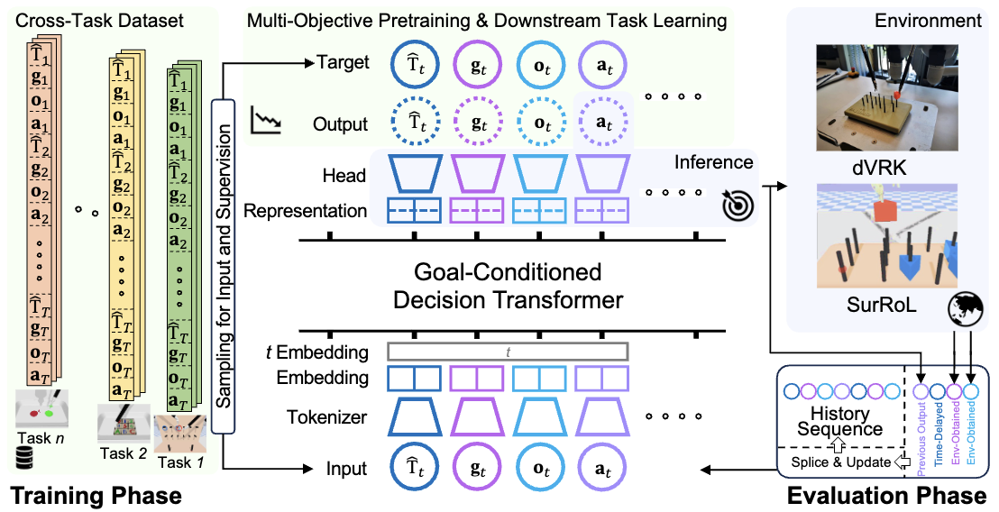

# Multi-objective Cross-task Learning via Goal-conditioned GPT-based Decision Transformers for Surgical Robot Task Automation
This is the official PyTorch implementation of our paper named "Multi-objective Cross-task Learning via Goal-conditioned GPT-based Decision Transformers for Surgical Robot Task Automation (ICRA2024)"
<p align="left">
  
</p>


# Installation

1. Clone this repository.
```bash
git clone https://github.com/med-air/SurRoL.git
cd rl
```

2. Create a virtual environment
```bash
conda create -n surrol-rl python=3.8
conda activate surrol-rl
```

3. Install packages

```bash
pip install -e SurRoL/	# install surrol environments
pip install -r requirements.txt
```


4. Then add one line of code at the top of `gym/gym/envs/__init__.py` to register SurRoL tasks:

```python
# directory: anaconda3/envs/surrol-rl/lib/python3.8/site-packages/
import surrol.gym
```

# Pretrained models and evaluation

- We have released the pretrained-models at (https://drive.google.com/drive/folders/1WFAhenAciJ1DJRfUwWGjxGC6lyFzKNgu)
Evaluate model with the ckpt path
```bash
python utils/evaluation.py --env task_name --ckpt_path /path/to/your/ckpt # You can change it to your task name (e.g., BiPegBoardRL-v0, PegTransferRL-v0) and ckpt path
```

# Training and Evaluation

1. Cross-task multi-objective pretraining

- Data generation for all tasks and copy these demonstration data to ./data/success_demo

```bash
mkdir SurRoL/surrol/data/demo
python SurRoL/surrol/data/data_generation.py --env NeedlePickRL-v0 
```

- Model cross-task multi-objective pretrain
```bash
python train_transformer.py --train_mode pretrain
```
Trained modules ckpt will be stored in ./checkpoints for following usage


2. Downstream task training
- Directly train
```bash
python train_transformer.py --train_mode train --env task_name
```
- Training from pretrained models
```bash
python train_transformer.py --train_mode train --use_pretrained --env task_name --ckpt_path /path/to/your/ckpt
```

# Training RL Policy with Demonstrations
We use the [DEX](https://github.com/med-air/DEX/tree/main) repository, which implements multiple state-of-the-art demonstration-guided RL algorithms, to train our RL policy. To run the training process, you should first install the dependencies by following the installation instructions from DEX. Then start the training by running the following command:
- Train **DEX** with demonstrations:
```bash
python train_rl.py task=NeedlePickRL-v0 agent=ddpgbc demo_path=your_demo_path
```
- Train **DDPGBC** with demonstrations:
```bash
python train_rl.py task=NeedlePickRL-v0 agent=ddpgbc demo_path=your_demo_path
```

python train_rl.py task=NeedleRegraspRL-v0 agent=awac demo_path=/research/d1/gds/jwfu/SurRoL_science_robotics_experiment_state_based/surrol/data/demo/data_NeedleRegraspRL-v0_random_200.npz


Note that you should specify the path of demonstration data you would like to provide to the RL agent, which could be collected by both human demonstrators or scripted controllers. For the latter, please refer to [here](../surrol/data/) for more details. 


# Code Navigation
```
rl
|- agents                # implements core algorithms in agent classes
|- components            # reusable infrastructure for model training
|    |- checkpointer.py  # handles saving + loading of model checkpoints
|    |- environment.py   # environment wrappers for SurRoL environments
|    |- normalizer.py    # normalizer for vectorized input
|    |- logger.py        # implements core logging functionality using wandB
|
|- modules               # reusable architecture components
|    |- critic.py        # basic critic implementations (eg MLP-based critic)
|    |- distributions.py # pytorch distribution utils for density model
|    |- policy.py    	   # basic actor implementations
|    |- replay_buffer.py # her replay buffer with future sampling strategy
|    |- sampler.py       # rollout sampler for collecting experience
|    |- subnetworks.py   # basic networks
|    |- trajectory_gpt2.py# basic networks for decision transformer
|
|- trainers              # main model training script, builds all components + runs training loop and logging
|
|- utils                 # general and rl utilities, pytorch / visualization utilities etc
|- train_transformer.py  # experiment launcher for goal conditioned decision transformer
|- train_rl.py           # experiment launcher for reinforcement learning
```

# Bibtex
If you find this repository helpful, please consider cite our paper as
```
@INPROCEEDINGS{fu2024multi,
  author={Fu, Jiawei and Yonghao, Long and Kai, Chen and Wang, wei and Dou, Qi},
  booktitle={2024 IEEE 21th International Conference on Robotics and Automation (ICRA)}, 
  title={Multi-objective Cross-task Learning via Goal-conditioned GPT-based Decision Transformers for Surgical Robot Task Automation}, 
  year={2024}
 }
 @article{long2023human,
  title={Human-in-the-loop Embodied Intelligence with Interactive Simulation Environment for Surgical Robot Learning},
  author={Long, Yonghao and Wei, Wang and Huang, Tao and Wang, Yuehao and Dou, Qi},
  journal={IEEE Robotics and Automation Letters (RAL)},
  year={2023}
}
@inproceedings{huang2023value,
  title={Value-Informed Skill Chaining for Policy Learning of Long-Horizon Tasks with Surgical Robot},
  author={Huang, Tao and Chen, Kai and Wei, Wang and Li, Jianan and Long, Yonghao and Dou, Qi},
  booktitle={2023 IEEE/RSJ International Conference on Intelligent Robots and Systems (IROS)},
  pages={8495--8501},
  year={2023},
  organization={IEEE}
}
@inproceedings{huang2023guided,
  title={Guided reinforcement learning with efficient exploration for task automation of surgical robot},
  author={Huang, Tao and Chen, Kai and Li, Bin and Liu, Yun-Hui and Dou, Qi},
  booktitle={2023 IEEE International Conference on Robotics and Automation (ICRA)},
  pages={4640--4647},
  year={2023},
  organization={IEEE}
}
```

# Acknowledgement

We thank the authors of [DEX](https://github.com/med-air/DEX) and [decision-transformer](https://github.com/kzl/decision-transformer)


# Contact
For any disscusion, please feel free to email jwfu@cse.cuhk.edu.hk.


python train_transformer.py --train_mode train --env MatchBoardRL-v0 > matchboard_twoexperts_withinit_9.txt