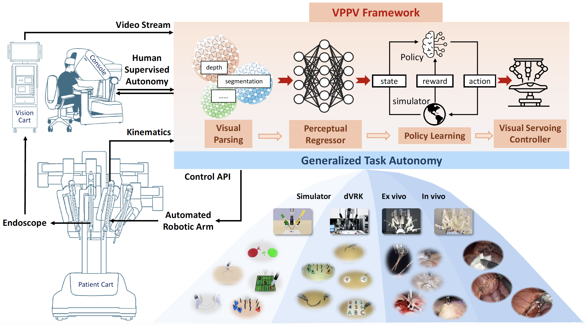

## Surgical embodied intelligence for generalized task autonomy in laparoscopic robot-assisted surgery

### [[Project Website]](https://med-air.github.io/SurRoL/)

**Science Robotics'25**: Surgical embodied intelligence for generalized task autonomy in laparoscopic robot-assisted surgery  [[Paper](https://www.science.org/doi/10.1126/scirobotics.adt3093)] [[Code](https://github.com/med-air/SurRoL/tree/SR-VPPV)]

**arXiv'24**: Efficient Physically-based Simulation of Soft Bodies in Embodied Environment for Surgical Robot  [[Paper](https://arxiv.org/abs/2402.01181)] [[Code](https://github.com/med-air/SurRoL/tree/Dev)]

**ICRA'24**: Multi-objective Cross-task Learning via Goal-conditioned GPT-based Decision Transformers for Surgical Robot Task Automation [[Paper](https://arxiv.org/abs/2405.18757)] [[Code](https://github.com/med-air/SurRoL/blob/Dev/rl/README.md)]

**IROS'23**: Value-Informed Skill Chaining for Policy Learning of Long-Horizon Tasks with Surgical Robot [[Paper](https://arxiv.org/abs/2307.16503)] [[Code](https://github.com/med-air/ViSkill)]

**RA-L'23**: Human-in-the-loop Embodied Intelligence with Interactive Simulation Environment for Surgical Robot Learning [[Paper](https://arxiv.org/abs/2301.00452)] [[Code](https://github.com/med-air/SurRoL/tree/SurRoL-v2)]

**ICRA'23**: Demonstration-Guided Reinforcement Learning with Efficient Exploration for Task Automation of Surgical Robot [[Paper](https://arxiv.org/abs/2302.09772)] [[Code](https://github.com/med-air/DEX)]

**ISMR'22**: Integrating Artificial Intelligence and Augmented Reality in Robotic Surgery: An Initial dVRK Study Using a Surgical Education Scenario [[Paper](https://arxiv.org/abs/2201.00383)]

**IROS'21**: SurRoL: An Open-source RL Centered and dVRK Compatible Platform for Surgical Robot Learning [[Paper](https://arxiv.org/abs/2108.13035)] [[Code](https://github.com/med-air/SurRoL/tree/main)]

<p align="center">
   
</p>


## Features

- [dVRK](https://github.com/jhu-dvrk/sawIntuitiveResearchKit/wiki) compatible [robots](./surrol/robots).
- [OpenAI Gym](https://github.com/openai/gym) style [API](./surrol/gym) for reinforcement learning.
- Rich collection of [assets](./surrol/assets) and task environments.
- Based on [PyBullet](https://github.com/bulletphysics/bullet3) and [Taichi](https://www.taichi-lang.org/) for physics simulation.
- Allow human interaction with [Touch Haptic Device](https://www.3dsystems.com/haptics-devices/touch) and real-world [dVRK](https://github.com/jhu-dvrk/sawIntuitiveResearchKit/wiki) robots.
- Zero-shot sim-to-real transfer capabilities

**System Requirements:** Ubuntu 20.04 with Python 3.7


## Code Structure

```

|- VPPV                          # surgical task automation framework
   |- Training                   # simulator training
      |- data_generation            # enviroment for generating the data to train perceptual regressor
      |- state_regress              # code for training perceptual regressor
      |- policy_learning            # enviroment for training the RL policy

   |- Deployment                 # VPPV deployment in the real world
      |- dVRK                    # code of VPPV deployment for game-based training tasks
      |- Sentire                 # code of VPPV deployment for ex vivo and in vivo experiments

|- Benchmark                     # benchmark for policy learning
    |- state_based                   # enviroment and implementation for state based methods
    |- vision_based                  # enviroment and implementation for vision based methods

|- Haptic_guidance               #  enviroment and implementation for intelligent haptic guidance

|- Data_driven_scene_simulation  #  enviroment and implementation for data driven surgical scene simulation


```

## Detailed Usage
### VPPV
The VPPV framework consists of two main components:
#### 1. Training
- **Data Generation** (`VPPV/Training/data_generation/`)
  - Environments for collecting training data
  - Use `python data_generation.py --env ${task_name}` to create datasets for perceptual regressor training
  
- **State Regression** (`VPPV/Training/state_regress/`)
  - Training scripts for perceptual regressor models
  - Run `python train.py` to train the network

- **Policy Learning** (`VPPV/Training/policy_learning/`)
  - RL training environments with pretrained perceptual regressor
  - Execute `python3 rl/train.py task=${task_name} agent=ddpg use_wb=True` to train control policies

#### 2. Deployment
- **dVRK Integration** (`VPPV/Deployment/dVRK/`)
  - Scripts for deploying game-based training tasks on real-world dVRK
  - Configuration files for robot setup
  - Run `python super_player.py --task ${task_name}` to excecute VPPV

- **Sentire System** (`VPPV/Deployment/Sentire/`)
  - Code for ex vivo and in vivo experiments
  - Run `python super_player.py --task ${task_name}` to excecute VPPV


### Haptic Guidance
Implementation of intelligent haptic guidance system:
- Located in `Haptic_guidance/`
- Includes haptic feedback algorithms
- Run `python tests/main.py` to start the demo

### Data-driven Scene Simulation
Tools for realistic surgical scene simulation:
- Found in `Data_driven_scene_simulation/`
- Data-driven scene reconstruction and simulation
- Run `python python gs_interaction.py` for simulation


## Other Useful Links

### 1. Hardware and software setup for da Vinci Research Kit (dVRK).

This project was developed on ROS Noetic with dVRK 2.1.

Follow [this guide](https://github.com/jhu-dvrk/sawIntuitiveResearchKit/wiki/CatkinBuild) to build and check all prerequisites listed [here](https://github.com/jhu-dvrk/sawIntuitiveResearchKit/wiki/FirstSteps#documentation).

More information about dVRK can be found at [dVRK documentation](https://dvrk.readthedocs.io/2.3.0/index.html) and [wiki page](https://github.com/jhu-dvrk/sawIntuitiveResearchKit/wiki).

### 2. Calibration.

Follow [this guide](https://github.com/YonghaoLong/EndoscopeCalibration) to calibrate the stereo endoscopic camera. 

Follow [this guide](https://github.com/Cartucho/dvrk_calib_hand_eye) for hand eye calibration of dVRK.

## Citation

If you find the paper or the code helpful to your research, please cite the project.

```
@inproceedings{xu2021surrol,
  title={SurRoL: An Open-source Reinforcement Learning Centered and dVRK Compatible Platform for Surgical Robot Learning},
  author={Xu, Jiaqi and Li, Bin and Lu, Bo and Liu, Yun-Hui and Dou, Qi and Heng, Pheng-Ann},
  booktitle={2021 IEEE/RSJ International Conference on Intelligent Robots and Systems (IROS)},
  year={2021},
  organization={IEEE}
}

@article{long2025surgical,
  title={Surgical embodied intelligence for generalized task autonomy in laparoscopic robot-assisted surgery},
  author={Long, Yonghao and Lin, Anran and Kwok, Derek Hang Chun and Zhang, Lin and Yang, Zhenya and Shi, Kejian and Song, Lei and Fu, Jiawei and Lin, Hongbin and Wei, Wang and others},
  journal={Science Robotics},
  volume={10},
  number={104},
  pages={eadt3093},
  year={2025},
  publisher={American Association for the Advancement of Science}
}
```
## License

The code is released under the [MIT license](LICENSE).


## Acknowledgement

The code is built with the reference of [dVRK](https://github.com/jhu-dvrk/sawIntuitiveResearchKit/wiki),
[AMBF](https://github.com/WPI-AIM/ambf),
[dVRL](https://github.com/ucsdarclab/dVRL),
[RLBench](https://github.com/stepjam/RLBench),
[Decentralized-MultiArm](https://github.com/columbia-ai-robotics/decentralized-multiarm),
[Ravens](https://github.com/google-research/ravens), etc.
